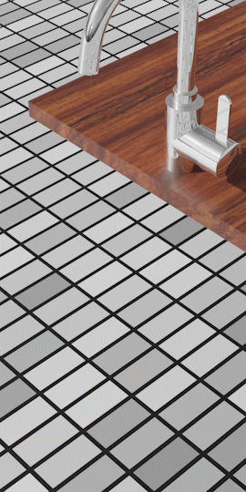

# pbstf
This repo implements paper *Position-Based Surface Tension Flow* (SIGGRAPH Aisa 2022). Several cases including:
1. Cubic droplet turns into a sphere without external force
2. Bouncing droplet
3. Faucet dripping

are validated. Here is an animation to be loaded.

## Code
Coming soon.
